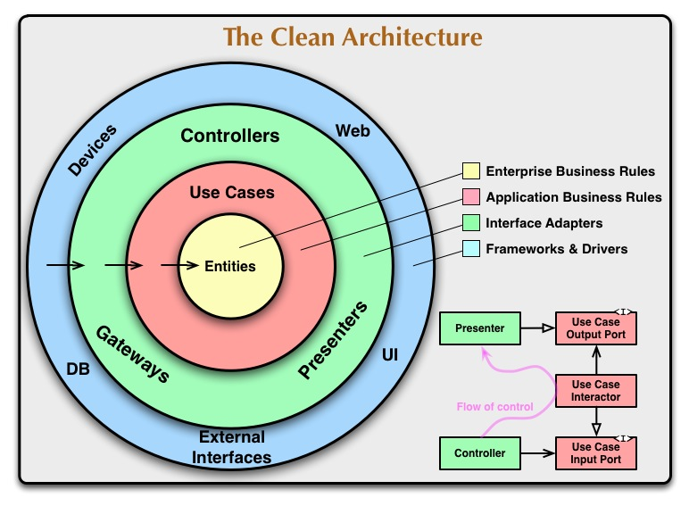

# PipeWeaver GitOps Application

<!-- [](https://github.com/codoworks/go-boilerplate/actions/workflows/go.yml)
[](https://goreportcard.com/report/github.com/codoworks/go-boilerplate)
[](https://github.com/codoworks/go-boilerplate/actions/workflows/codeql.yml)
[](https://github.com/codoworks/go-boilerplate/actions/workflows/codacy.yml)
[](https://gist.github.com/cheerfulstoic/d107229326a01ff0f333a1d3476e068d) -->

This is a data engineering platform application I (Suhaib Shah) am working on. This project serves mainly to help me learn more about how GitOps tooling can be built to serve platform usecases relevant to data engineering and a data platforms.
This service is written using `GoLang v1.22.5`.

```
  ____  _          __        __
 |  _ \(_)_ __   __\ \      / /__  __ ___   _____ _ __
 | |_) | | '_ \ / _ \ \ /\ / / _ \/ _` \ \ / / _ \ '__|
 |  __/| | |_) |  __/\ V  V /  __/ (_| |\ V /  __/ |
 |_|   |_| .__/ \___| \_/\_/ \___|\__,_| \_/ \___|_|
         |_|
```

### Architecture

In its current state this application will accept webhook calls from a git repository (of your choosing), where it will process pipelines defined in YAML files and generate Apache Airflow DAGs in a destination directory. Only merging into the 'main' branch will trigger this application to generate the corresponding Airflow, for the sake of simplicity require your merge commits to be squashed merges, one squashed merge commit will contain a combined list of all files modified.

#### Sample Pipeline Definition

Here is sample pipeline definition, that will be translated into an Airflow DAG python script.

```
pipeline:
  name: "pg_to_snowflake_ingest"
  version: "1.0.0"
  domain: "data-platform"
  description: "Extract some data and load some data"

  schedule:
    type: "cron"
    expression: "0 3 * * *" #daily at 3 AM

  steps:
    - name: "extract-and-load"
      type: "ingestion"
      description: "Extract from Postgres, load into Snowflake"
      inputs:
        - name: "postgres-source"
          type: "postgres"
          host: "subscription-db.exampled.com"
          database: "subscriptions"
          table: "user_subscriptions"
      outputs:
        - name: "snowflake-dest"
          type: "snowflake"
          table_name: "analytics.user_subscriptions"

resources:
  compute_cluster: "data-platform-default-cluster"
```

#### Clean Architecture Diagram

This service is _loosely_ structured using a hexagonal architecture (AKA Clean Architecture), at its core we treat our pipeline definitions as our domain models (which in this case are in a Git repository, much like we would have rows in a database _repository_). Our adapter layers will map between our domain and usecase layer. The usecases is where our business logic is contained. The application layer contains our application entry points (i.e controllers, scheduled tasks, etc).



### Usage

Environment variables are evaluated in the following order to allow flexibility when running in production:

1. `.env` file
2. environment variables
3. cmd flags (if available)

During development, it is recommended to use a `.env` file. You can find a reference under /.env.sample` to get started.

### Roadmap

- [x] Queue based processing of webhooks
- [x] Support for template versioning
- [ ] Distributed locking and concurrency management
- [ ] Preview DAG generation when PR is raised (like TF plan)
- [ ] Enhanced error handling
- [ ] Code cleanup and in-line documentation
- [ ] Swagger integration
- [ ] Postman collection
- [ ] More documentation

### Contribution

Feel free to start a new discussion, submit a new PR, make a feature request or etc.. If you would like to join the team, reach out to us on Discord. We are always looking for contributors!

### Contacts

- [My Website](https://syedsuhaibshah.com)
- [My Email](mailto:suhaibshah22@gmail.com)
